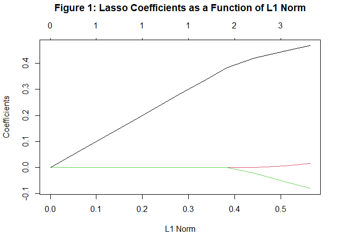
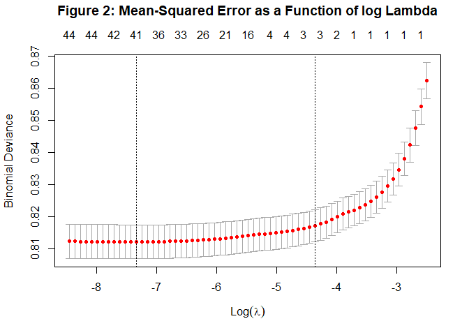
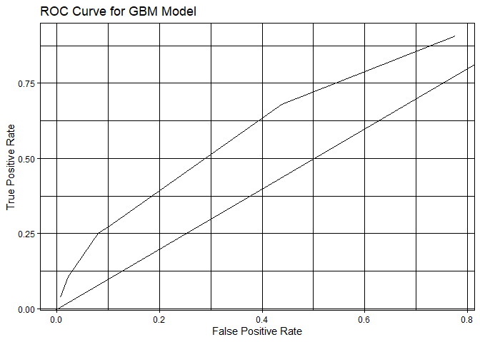
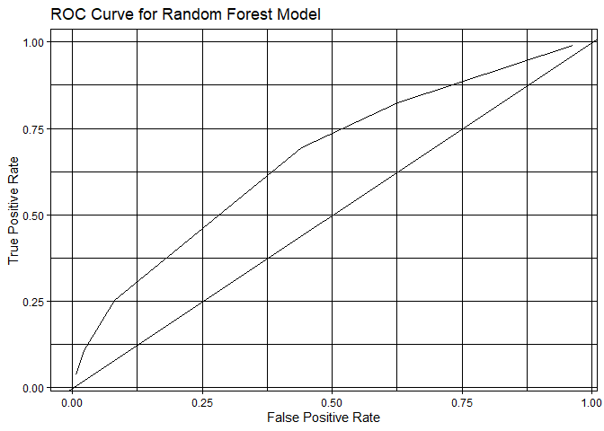

    library(tidyverse)
    library(mosaic)
    library(ggplot2)
    library(dplyr)
    library(tidyr)
    library(ggmap)
    library(geojsonio)
    library(broom)
    library(data.table)
    library(rsample)
    library(caret)
    library(modelr)
    library(knitr)
    library(parallel)
    library(foreach)
    library(pdp)
    library(rpart)
    library(rpart.plot)
    library(gbm)
    library(randomForest)
    library(glmnet)
    library(kableExtra)
    library(pROC)

# Data Visualization

## Feature Engineering and Data Loading

# Data Visualization

## Subsetting geojson

# Data Visualization

## Visualizing

# Question: Does Race play a part in the prevailing arrest rate?

## Some Visualizations…

# Models

## First Model: Logistic Regression

## Second Model: Stepwise Selection

In terms of the types of models, we started with a baseline logistic
regression model, with the specification of clearance\_status on
everything else. After that, using the stepwise variable selection
function, we computed the best set of variables and the interaction
between them which performed the best. The logistic model chose by the
stepwise function is

`clearance_status ~ population_density + median_income + median_home_value +      prop_white + arrest_rate + zipcode + median_home_value:arrest_rate +      median_income:arrest_rate + median_home_value:zipcode + median_income:prop_white +      prop_white:arrest_rate + arrest_rate:zipcode + population_density:prop_white +      population_density:median_home_value + population_density:arrest_rate`

## Third Model: Random Forest

We repeated the process for gradient boosted models. We used Gradient
Boosting models with distribution as “gaussian”, the number of trees as
10000, shrinkage as 0.01,and with a interaction depth of 4.

## Fourth Model: Gradient Boosting

## Fifth Model: Lasso Model

<table class="table table-striped" style="width: auto !important; margin-left: auto; margin-right: auto;">
<caption>
**Table 1 Lasso Model Predictor Estimates**
</caption>
<thead>
<tr>
<th style="text-align:left;">
Predictor
</th>
<th style="text-align:right;">
Estimate
</th>
</tr>
</thead>
<tbody>
<tr>
<td style="text-align:left;">
(Intercept)
</td>
<td style="text-align:right;">
-1.7674363
</td>
</tr>
<tr>
<td style="text-align:left;">
population\_density
</td>
<td style="text-align:right;">
0.0000000
</td>
</tr>
<tr>
<td style="text-align:left;">
median\_income
</td>
<td style="text-align:right;">
0.0000000
</td>
</tr>
<tr>
<td style="text-align:left;">
median\_home\_value
</td>
<td style="text-align:right;">
0.0000000
</td>
</tr>
<tr>
<td style="text-align:left;">
prop\_white
</td>
<td style="text-align:right;">
0.0000000
</td>
</tr>
<tr>
<td style="text-align:left;">
arrest\_rate
</td>
<td style="text-align:right;">
0.4681788
</td>
</tr>
<tr>
<td style="text-align:left;">
as.factor(zipcode)78617
</td>
<td style="text-align:right;">
0.0000000
</td>
</tr>
<tr>
<td style="text-align:left;">
as.factor(zipcode)78652
</td>
<td style="text-align:right;">
0.0000000
</td>
</tr>
<tr>
<td style="text-align:left;">
as.factor(zipcode)78653
</td>
<td style="text-align:right;">
0.0000000
</td>
</tr>
<tr>
<td style="text-align:left;">
as.factor(zipcode)78660
</td>
<td style="text-align:right;">
0.0000000
</td>
</tr>
<tr>
<td style="text-align:left;">
as.factor(zipcode)78701
</td>
<td style="text-align:right;">
0.0000000
</td>
</tr>
<tr>
<td style="text-align:left;">
as.factor(zipcode)78702
</td>
<td style="text-align:right;">
0.0000000
</td>
</tr>
<tr>
<td style="text-align:left;">
as.factor(zipcode)78703
</td>
<td style="text-align:right;">
0.0000000
</td>
</tr>
<tr>
<td style="text-align:left;">
as.factor(zipcode)78704
</td>
<td style="text-align:right;">
0.0000000
</td>
</tr>
<tr>
<td style="text-align:left;">
as.factor(zipcode)78705
</td>
<td style="text-align:right;">
0.0000000
</td>
</tr>
<tr>
<td style="text-align:left;">
as.factor(zipcode)78712
</td>
<td style="text-align:right;">
0.0000000
</td>
</tr>
<tr>
<td style="text-align:left;">
as.factor(zipcode)78717
</td>
<td style="text-align:right;">
0.0000000
</td>
</tr>
<tr>
<td style="text-align:left;">
as.factor(zipcode)78719
</td>
<td style="text-align:right;">
0.0000000
</td>
</tr>
<tr>
<td style="text-align:left;">
as.factor(zipcode)78721
</td>
<td style="text-align:right;">
0.0000000
</td>
</tr>
<tr>
<td style="text-align:left;">
as.factor(zipcode)78722
</td>
<td style="text-align:right;">
0.0000000
</td>
</tr>
<tr>
<td style="text-align:left;">
as.factor(zipcode)78723
</td>
<td style="text-align:right;">
0.0000000
</td>
</tr>
<tr>
<td style="text-align:left;">
as.factor(zipcode)78724
</td>
<td style="text-align:right;">
0.0000000
</td>
</tr>
<tr>
<td style="text-align:left;">
as.factor(zipcode)78725
</td>
<td style="text-align:right;">
0.0000000
</td>
</tr>
<tr>
<td style="text-align:left;">
as.factor(zipcode)78726
</td>
<td style="text-align:right;">
0.0000000
</td>
</tr>
<tr>
<td style="text-align:left;">
as.factor(zipcode)78727
</td>
<td style="text-align:right;">
0.0000000
</td>
</tr>
<tr>
<td style="text-align:left;">
as.factor(zipcode)78728
</td>
<td style="text-align:right;">
0.0000000
</td>
</tr>
<tr>
<td style="text-align:left;">
as.factor(zipcode)78729
</td>
<td style="text-align:right;">
0.0000000
</td>
</tr>
<tr>
<td style="text-align:left;">
as.factor(zipcode)78730
</td>
<td style="text-align:right;">
0.0000000
</td>
</tr>
<tr>
<td style="text-align:left;">
as.factor(zipcode)78731
</td>
<td style="text-align:right;">
0.0000000
</td>
</tr>
<tr>
<td style="text-align:left;">
as.factor(zipcode)78733
</td>
<td style="text-align:right;">
0.0000000
</td>
</tr>
<tr>
<td style="text-align:left;">
as.factor(zipcode)78735
</td>
<td style="text-align:right;">
0.0000000
</td>
</tr>
<tr>
<td style="text-align:left;">
as.factor(zipcode)78736
</td>
<td style="text-align:right;">
0.0000000
</td>
</tr>
<tr>
<td style="text-align:left;">
as.factor(zipcode)78739
</td>
<td style="text-align:right;">
0.0000000
</td>
</tr>
<tr>
<td style="text-align:left;">
as.factor(zipcode)78741
</td>
<td style="text-align:right;">
0.0000000
</td>
</tr>
<tr>
<td style="text-align:left;">
as.factor(zipcode)78742
</td>
<td style="text-align:right;">
0.0000000
</td>
</tr>
<tr>
<td style="text-align:left;">
as.factor(zipcode)78744
</td>
<td style="text-align:right;">
0.0000000
</td>
</tr>
<tr>
<td style="text-align:left;">
as.factor(zipcode)78745
</td>
<td style="text-align:right;">
0.0000000
</td>
</tr>
<tr>
<td style="text-align:left;">
as.factor(zipcode)78746
</td>
<td style="text-align:right;">
0.0150376
</td>
</tr>
<tr>
<td style="text-align:left;">
as.factor(zipcode)78747
</td>
<td style="text-align:right;">
0.0000000
</td>
</tr>
<tr>
<td style="text-align:left;">
as.factor(zipcode)78748
</td>
<td style="text-align:right;">
-0.0808627
</td>
</tr>
<tr>
<td style="text-align:left;">
as.factor(zipcode)78749
</td>
<td style="text-align:right;">
0.0000000
</td>
</tr>
<tr>
<td style="text-align:left;">
as.factor(zipcode)78750
</td>
<td style="text-align:right;">
0.0000000
</td>
</tr>
<tr>
<td style="text-align:left;">
as.factor(zipcode)78751
</td>
<td style="text-align:right;">
0.0000000
</td>
</tr>
<tr>
<td style="text-align:left;">
as.factor(zipcode)78752
</td>
<td style="text-align:right;">
0.0000000
</td>
</tr>
<tr>
<td style="text-align:left;">
as.factor(zipcode)78753
</td>
<td style="text-align:right;">
0.0000000
</td>
</tr>
<tr>
<td style="text-align:left;">
as.factor(zipcode)78754
</td>
<td style="text-align:right;">
0.0000000
</td>
</tr>
<tr>
<td style="text-align:left;">
as.factor(zipcode)78756
</td>
<td style="text-align:right;">
0.0000000
</td>
</tr>
<tr>
<td style="text-align:left;">
as.factor(zipcode)78757
</td>
<td style="text-align:right;">
0.0000000
</td>
</tr>
<tr>
<td style="text-align:left;">
as.factor(zipcode)78758
</td>
<td style="text-align:right;">
0.0000000
</td>
</tr>
<tr>
<td style="text-align:left;">
as.factor(zipcode)78759
</td>
<td style="text-align:right;">
0.0000000
</td>
</tr>
</tbody>
</table>

## Confusion Matrix for the best model…

 \#\#
Confusion Matrix for the second best model…

## Sanity-Check: Confusion Matrix for the logit model…

